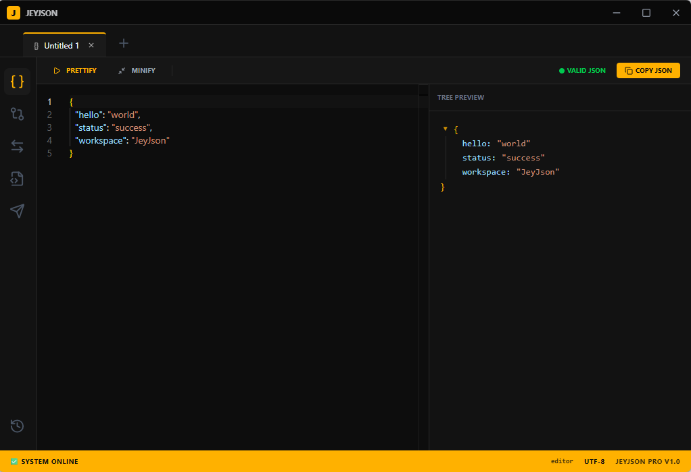

# JeyJson 🚀
> The Premium, Ultra-Fast, Frameless JSON Swiss Army Knife for Developers.

JeyJson is a native, modern, and high-performance desktop application designed to streamline how developers view, format, validate, and manipulate JSON data. Built with speed and elegance in mind, it completely eliminates the need for laggy online web tools.

---

## 📸 Preview

*Replace this with your actual application screenshot once compiled.*

---

## 🌐 English Description

### ✨ Key Features
* **Isolated Multi-Tab UX:** Work on multiple JSON files simultaneously. Switching tabs or views never corrupts or loses your data.
* **Modern Frameless UI:** A premium, high-contrast dark theme with vibrant orange/yellow accents, featuring a fully custom-tailored OS window control bar.
* **Interactive Tree View:** Easily expand or collapse JSON nodes with real-time array/object item count indicators.
* **Native File Integration (Ctrl+S):** Seamlessly open and save `.json`, `.xml`, `.yaml`, and `.txt` files directly onto your local disk.
* **Advanced JSON Diff Tool:** Compare any two open documents dynamically using a split-screen layout powered by Monaco Editor.
* **Mini HTTP Client:** A built-in, lightweight API runner (Postman Lite) to fetch JSON responses directly into your editor without CORS issues.
* **Format Converter:** Instantly convert structures between JSON, XML, YAML, and CSV with a single click.
* **JSON to Code:** Automatically compile JSON payloads into clean C# Classes, TypeScript Interfaces, Java POJOs, or Python Data Models.

### 🛠️ Tech Stack
* **Backend:** Tauri v2 (Rust) — for instant startup times, ultra-low memory footprint, and secure native OS permissions.
* **Frontend:** React, TypeScript, Tailwind CSS, Monaco Editor (`@monaco-editor/react`).

### 🚀 Getting Started (Development)
1. Clone the repository.
2. Install dependencies: `npm install`
3. Run the application in development mode: `npm run tauri dev`
4. Build the production package: `npm run tauri build`

---

## 🌐 توضیحات فارسی (Persian)

**برنامه JeyJson** یک ابزار بومی (Native)، مدرن و فوق‌العاده سریع برای سیستم‌عامل‌های ویندوز، مک و لینوکس است که به عنوان یک جعبه‌ابزار همه‌فن‌حریف برای کار با ساختارهای JSON طراحی شده است. این نرم‌افزار با حذف نیاز به سایت‌های آنلاین، حریم خصوصی امن‌تر و سرعت بسیار بالاتری را در جریان کاری برنامه‌نویسان فراهم می‌کند.

### ✨ قابلیت‌های کلیدی
* **رابط کاربری تب‌محور و مستقل (Multi-Tab UX):** امکان کار همزمان روی چندین سند مختلف بدون تداخل اطلاعات یا پاک شدن موقتی داده‌ها در هنگام سوییچ بین ابزارها.
* **ظاهر مدرن و بدون فریم (Frameless UI):** طراحی اختصاصی نوار بالایی برنامه (Custom Titlebar) هماهنگ با تم تاریکِ پرمیوم و لوکس (بر پایه رنگ‌های مشکی عمیق و هایلایت‌های زنده نارنجی/زرد).
* **نمایش درختی هوشمند (Interactive Tree View):** امکان جمع کردن و باز کردن گره‌ها به همراه نمایش دقیق تعداد اعضای هر آرایه یا شیء.
* **تعامل مستقیم با سیستم‌عامل (Ctrl+S):** پشتیبانی از باز کردن و ذخیره مستقیم فایل‌های با پسوند `.json` ، `.xml` ، `.yaml` و غیره روی حافظه سیستم.
* **ابزار پیشرفته مقایسه (JSON Diff Tool):** امکان انتخاب دو فایل از میان تب‌های باز برنامه و مقایسه خط‌به‌خط آن‌ها در ادیتور پیشرفته Monaco.
* **اجرا کننده درخواست کوچک (Mini HTTP Client):** یک کلاینت API سبک داخلی برای ارسال درخواست‌های شبکه و دریافت مستقیم و فرمت‌شدهٔ پاسخ‌های JSON بدون محدودیت‌های CORS.
* **مبدل فرمت‌ها (Format Converter):** تبدیل فرمت آنی و دوطرفه بین JSON و ساختارهای XML، YAML و CSV.
* **تبدیل ساختار به کد (JSON to Code):** تولید خودکار کلاس‌های C#، اینترفیس‌های TypeScript، پوجوهای Java و دیتامدل‌های Python از روی ساختار JSON.

### 🛠️ تکنولوژی‌های مورد استفاده
* **بک‌اند (Backend):** فریمورک Tauri v2 (زبان Rust) جهت کاهش حجم خروجی (زیر ۲۰ مگابایت)، سرعت لود آنی و مصرف رم ناچیز.
* **فرانت‌اند (Frontend):** کتابخانه‌های React ، TypeScript، استایل‌دهی Tailwind CSS و هسته Monaco Editor (استفاده‌شده در VS Code).

---

## 📄 License
This project is licensed under the MIT License - see the LICENSE file for details.